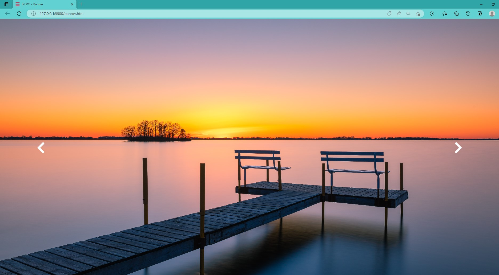

<h1 align="center"> Slider Background Image </h1>

    HTML development for image change with CSS and Javascript.

  <a href="#-tecnologias">Technologies</a>&nbsp;&nbsp;&nbsp;|&nbsp;&nbsp;&nbsp;
  <a href="#-projeto">Project</a>&nbsp;&nbsp;&nbsp;|&nbsp;&nbsp;&nbsp;
  <a href="#-layout">References</a>&nbsp;&nbsp;&nbsp;|&nbsp;&nbsp;&nbsp;
  <a href="#memo-licença">Licence</a>

  

 

  

  

  

## 🚀 Technologies

This project was developed with the following technologies:

- HTML e CSS
- JavaScript
- [Font-awasome](https://fontawesome.com/v4/get-started/)

## 💻 Project

Designed to share news, commemorative events, company notices.

## 💻 Project

HTML

 banner.html - Click Full screen 

 banner2.html - Automatic 

 banner3.html - Click Screen 

Folders: 

 img - import image in html file 

 font-awesome - import chevron  

Links Usefull:

HTML Formatter -  https://www.freeformatter.com/html-formatter.html

## 🔖 References

- https://codingwithnick.in/background-image-slider-using-html-css-javascript/
- https://www.w3schools.com/howto/tryit.asp?filename=tryhow_js_slideshow_auto

## :memo: Licence

This project is under the MIT license.

---

Made with ♥ by Karoline :wave: [Let's program together!](https://www.linkedin.com/in/karoline-hikari-yamamoto/)

